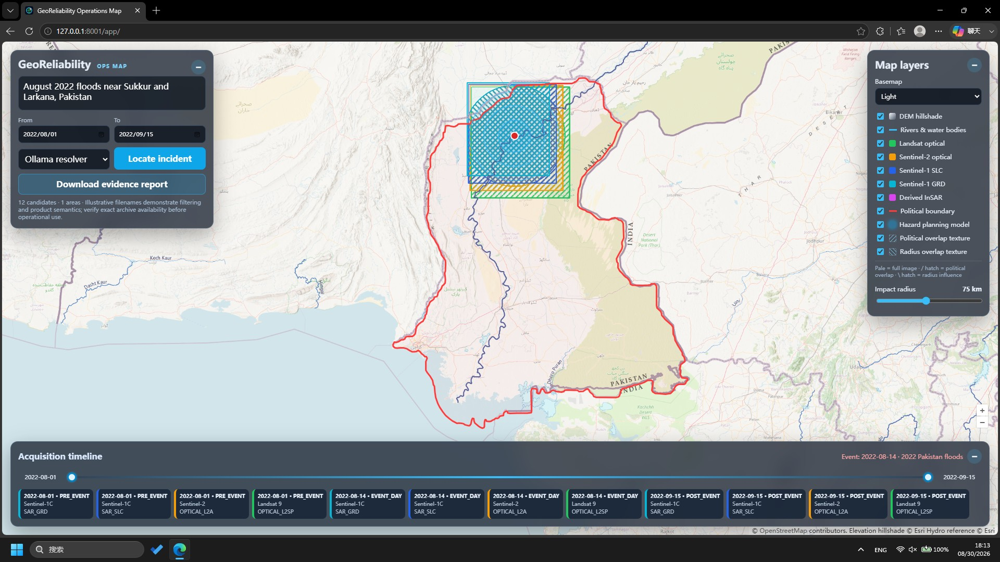

# GeoReliability Agent

An evidence-first disaster and data investigation workflow. It turns a natural-language disaster requirement into mapped districts and date-filtered satellite candidates, then reuses the original reliability engine to audit the metadata.

**Submission entry points:** [reproduce the project](docs/REPRODUCTION.md) · [review measured results](EVALUATION.md) · [follow the improvement changelog](IMPROVEMENT_CHANGELOG.md) · [record the five-minute demo](docs/DEMO_SCRIPT.md) · [inspect agent contracts](AGENT_INSTRUCTIONS.md)

## Demo



The map combines disaster resolution, administrative-boundary provenance,
satellite planning candidates, temporal filtering, hydrography, affected-area
textures, and downloadable evidence reporting.

## User and bottleneck

Data analysts regularly inherit files without trustworthy documentation. Manual inspection is inconsistent and a direct LLM prompt can make plausible claims without calculating evidence. This project combines agent-selected investigation plans with deterministic checks and independent verification. Every accepted claim points to calculated evidence.

## Current capability

- Resolves disaster location and temporal range with local Ollama, with a reproducible fallback.
- Maps matched areas and lists candidate Landsat 9, Sentinel-1C SLC/GRD, Sentinel-2 Level-2A, and derived InSAR filenames first.
- Centers an interactive map on the incident, with target-boundary and satellite-footprint polygons plus hover metadata.
- Provides light, night, and satellite basemaps plus collapsible controls for a map-first operations view.
- Enforces a cartographic layer stack, textures candidate scene coverage, and exports a Markdown evidence report with provenance, availability, recommendations, and limitations.
- Produces explicitly labeled, unverified planning candidates for Ollama-resolved floods, storms, wildfires, landslides, and earthquakes outside the curated demo catalog.
- Filters candidates by date, platform, product type, and district.
- Exposes the workflow through CLI, FastAPI, and a two-workflow Streamlit UI.
- Profiles CSV, Excel, JSON-record, and Parquet tables without modifying the source.
- Uses Ollama to select checks from a controlled tool catalog.
- Falls back deterministically when Ollama is unavailable.
- Detects missing values, duplicates, duplicate IDs, negative measures, suspicious zeros, extreme outliers, category formatting collisions, monthly gaps, and selected total mismatches.
- Independently verifies evidence contracts.
- Writes a Markdown report, structured JSON result, and JSONL trajectory.
- Includes a fair basic baseline and generated benchmark cases.
- Proposes bounded repairs, requires explicit proposal IDs, forbids source overwrite, and writes a separate copy.
- Provides a Streamlit demonstration and reproducible Docker deployment.

## Quick start on WSL Ubuntu

```bash
cd ~/data-reliability-agent
python3 -m venv .venv
source .venv/bin/activate
python -m pip install --upgrade pip
python -m pip install -e '.[all]'
make test
make demo
make evaluate
make discover
make submission-check
```

Run with Ollama:

```bash
ollama list
export OLLAMA_MODEL=qwen2.5-coder:7b  # replace with an installed model
curl http://localhost:11434/api/tags
make benchmark
data-reliability investigate benchmark/cases/case_06_multi_issue.csv \
  --goal "Assess whether this dataset is safe for monthly KPI reporting" \
  --mode ollama
```

If Ollama runs on Windows and WSL cannot reach `localhost`, determine the Windows host address and set:

```bash
export OLLAMA_BASE_URL=http://WINDOWS_HOST_IP:11434
```

Do not hard-code that address in the repository.

## Exact commands

```bash
make benchmark
make baseline
make demo
make evaluate
make ui
```

Open `http://localhost:8501` for the interactive demo.

## Full-screen operations map

The primary GIS presentation is now a true OpenLayers application served by FastAPI. Unlike Streamlit, the map occupies the entire viewport and the search, layer controls, timeline, legend, and acquisition details float over it as translucent panels.

```bash
make web
```

Open `http://localhost:8001/app/`. The API remains available at `http://localhost:8001/docs`, while the Streamlit table-investigation interface remains available through `make ui`. Override the development port when needed with `make web PORT=8010`.

The OpenLayers map includes independent optical/SLC/GRD/InSAR visibility, click and hover inspection, authoritative-boundary provenance, automatic incident zoom, one dual-ended acquisition timeline, and independently toggled political-overlap and planning-radius textures.

The satellite catalog bundled with the demo is illustrative, not a claim of exact remote archive availability. Dynamically generated filenames begin with `ILLUSTRATIVE_`, remain `verified_remote=false`, and are candidates rather than provider search results. The UI and JSON output expose `catalog_status` and `verified_remote`; see [the remote-sensing design](docs/REMOTE_SENSING.md).

On the map, hover over district or scene polygons for time, CRS, and band information. Select a filename to inspect the full scene contract. Administrative boundaries carry source/fallback provenance; colored satellite footprints remain illustrative.

The landing state is a global map with floating search controls. A successful search recenters the map on the incident. The acquisition timeline slices visible footprints while preserving the actual event date for pre/post classification.

Map layers can be toggled independently by optical/SAR/InSAR product class. Administrative outlines are resolved from geoBoundaries ADM2 when network access is available and carry source/year/license metadata. The affected-area circle is a user-adjustable planning radius, not an inferred damage polygon.

Run the local API:

```bash
make api
curl http://localhost:8001/health
curl -X POST 'http://localhost:8001/discover?mode=deterministic' \
  -H 'Content-Type: application/json' \
  -d '{"query":"January 2025 earthquake near Dingri, Tibet and Nepal","start_date":"2025-01-01","end_date":"2025-01-31"}'
```

## Human-approved repair example

Run an investigation first, inspect its report and proposal IDs, then approve only the intended changes:

```bash
data-reliability apply-repairs outputs/RUN_ID/result.json \
  --approve normalize-category-region,null-negative-revenue \
  --output outputs/RUN_ID/repaired.csv
```

The command refuses an empty approval list, unknown proposal IDs, and any attempt to overwrite the source.

## Docker reproduction

```bash
export OLLAMA_MODEL=YOUR_INSTALLED_MODEL
docker compose up --build
```

The container drops Linux capabilities and enables `no-new-privileges`. Ollama remains outside the container and is reached through `host.docker.internal`.

The demo writes:

```text
outputs/<run-id>/report.md
outputs/<run-id>/result.json
outputs/<run-id>/trajectory.jsonl
```

## Baseline

The baseline is an ordinary profiling script that detects only missing cells and exact duplicate rows. The final workflow receives the same files but can select a broader set of deterministic checks and verifies every resulting claim.

On the controlled 11-case benchmark, baseline F1 is 0.333 and the advanced workflow F1 is 1.000. See [EVALUATION.md](EVALUATION.md) for the fair-comparison contract and limitations.

## Hackathon scope and coding-agent disclosure

The repository was created during the Frontier Engineering Challenge. The initial Day 1 vertical slice covered table profiling, allowlisted planning, evidence verification, reporting, trajectories, a baseline, and six benchmark cases. Day 2–3 work added formats, human-approved repairs, expanded evaluation, deployment, disaster resolution, remote-sensing planning, and the map-first GIS interface. The detailed sequence and rejected/constrained choices are recorded in [IMPROVEMENT_CHANGELOG.md](IMPROVEMENT_CHANGELOG.md).

AI coding assistance was used throughout implementation, debugging, test design, and documentation. Ollama is also an optional runtime planner. Neither coding-agent output nor runtime model output is treated as factual evidence without human review or deterministic verification. Representative trajectory packaging is described in [trajectories/README.md](trajectories/README.md).

## Safety

Investigation is read-only. The system never executes LLM-generated code. Repairs use a small allowlisted action set, require explicit approval, and always produce a new file.

Runtime maps use third-party services and display their credits. See [THIRD_PARTY_NOTICES.md](THIRD_PARTY_NOTICES.md) before reuse or deployment. The repository owner should also choose and add an explicit license for this project's own source code before inviting reuse; no license is implied by a public repository.

## Current limitations

- Excel and Parquet require the optional `formats` dependencies.
- Semantic domain rules are limited without an explicit data contract.
- IQR outliers are investigation leads, not proof of erroneous data.
- Ollama chooses checks but does not directly author evidence or final factual claims.
- The offline district points and satellite filenames are demonstration metadata; production use requires authoritative polygons and live provider catalog verification.
- Public basemap, boundary, and tile services may be rate-limited or unavailable; the deterministic data workflow remains runnable without them.
