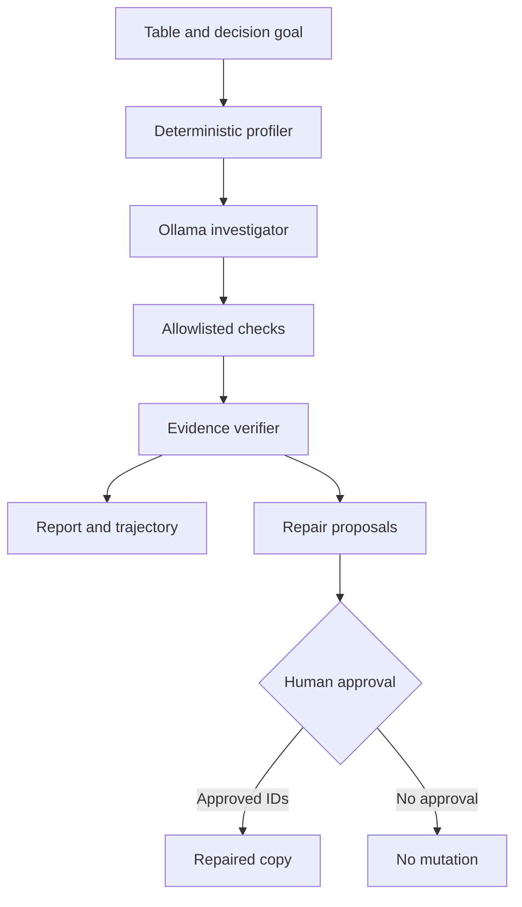

# Architecture



The LLM controls check selection, not factual results. Check implementations calculate evidence. The verifier controls which evidence becomes a finding. Repair execution is a separate, explicit post-investigation action.

## Trust boundaries

| Boundary | Control |
|---|---|
| Model output | Pydantic schema plus enum allowlist |
| Dataset | Read-only during investigation |
| Factual claims | Deterministic evidence and verifier |
| Repairs | Allowlisted actions and exact human-approved IDs |
| Original data | Resolved-path comparison prevents overwrite |
| Container | Non-root user, dropped capabilities, no-new-privileges |
# GeoReliability extension

The disaster workflow adds a bounded geospatial pipeline ahead of the existing verifier:

```text
requirement -> Ollama event resolver -> offline district matcher -> deterministic catalog filters
            -> filename-first results -> catalog metadata reliability investigation
```

Ollama may structure event intent, but it never invents or validates satellite identifiers. Filtering and evidence checks remain deterministic. The same discovery contract is exposed through CLI, FastAPI, and Streamlit.

